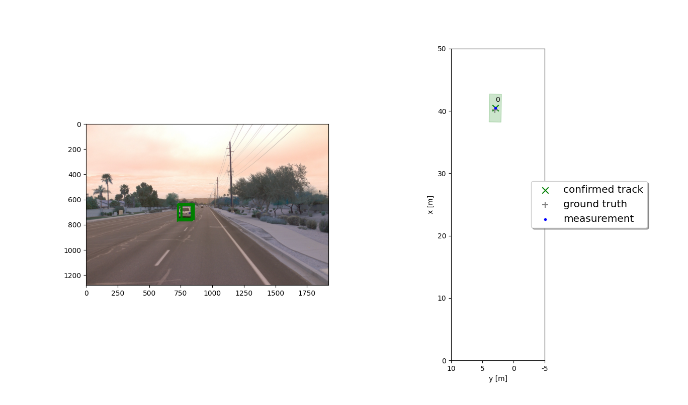
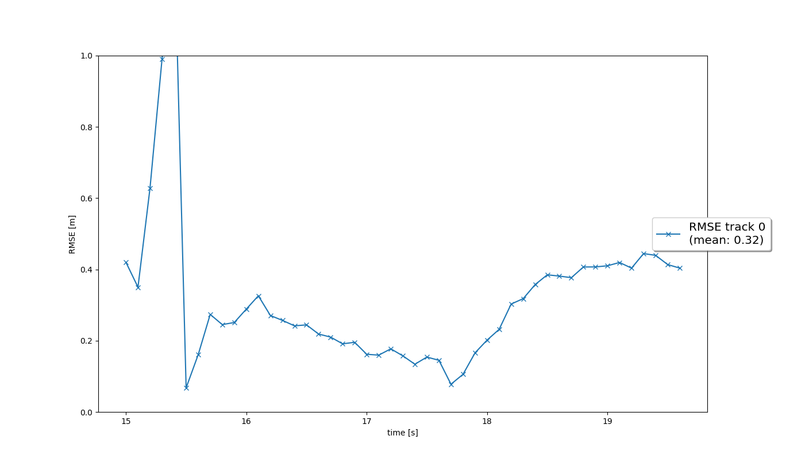
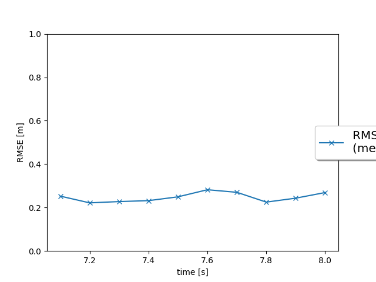
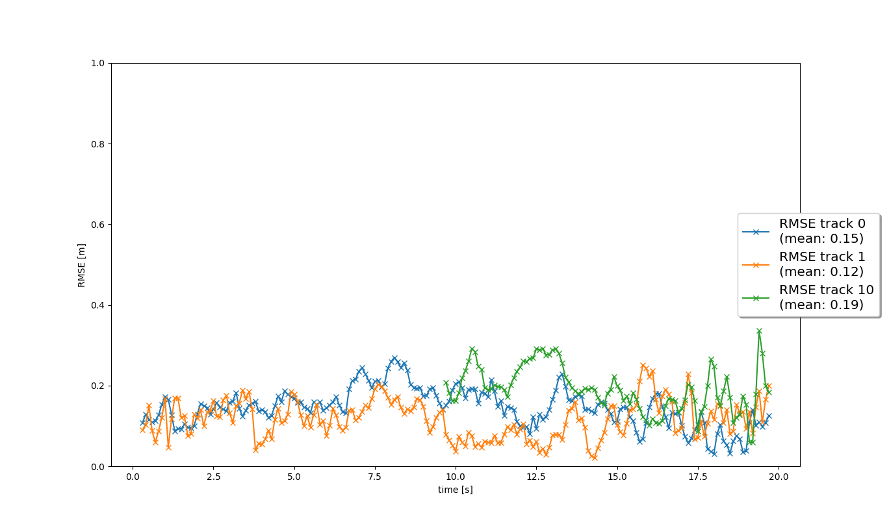

# Final Project
## Project overview
The final project consists of four main steps: 

    Step 1: Implement an extended Kalman filter.
    Step 2: Implement track management including track state and track score, track initialization and deletion.
    Step 3: Implement single nearest neighbour data association and gating.
    Step 4: Apply sensor fusion by implementing the nonlinear camera measurement model and a sensor visibility check.

## Step 1: Extended Kalman Filter (EKF)
I implemented an EKF in the "filter.py"
These images are the result of tracking and RMSE.

tracking 

RMSE 

## Step 2: Track Management
I implemented an Track Management in the "trackmanagement.py"

RMSE 

## Step 3: Data Association and Gating
I implemented an Track Management in the "association.py"

RMSE 

## Step 4: Sensor Fusion
