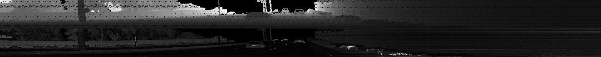
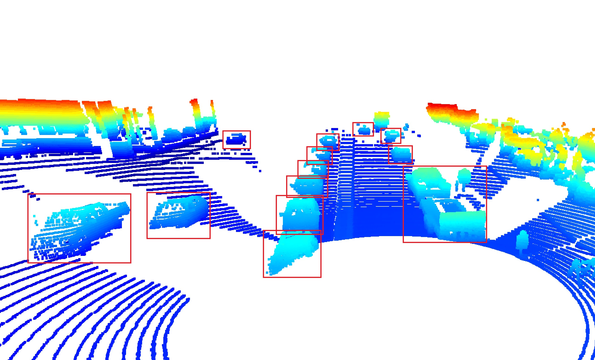
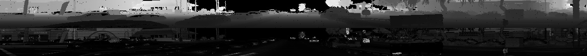

## Project overview
The main purpose of this step is "Compute Lidar Point-Cloud from Range Image".
I wrote the code within the function "show_range_image" and "show_pcl" in the file "objdet_pcl.py".

### Visualize range image channels (ID_S1_EX1)
This image is the result of visualizing range and intensity channels.
The data from lidar point-cloud was converted from the floating-point data to an 8-bit integer value.
This image is stacked "range" and "intensity" channel.
The upper harf region shows "range" channel.
The lower harf region shows "intensity" channel.
This image is cropped to +/- 90 deg, shows left and right of the forward-facing x-axis.

"range" and "intensity" image 

### Visualize point-cloud (ID_S1_EX2)
This image is the result of visualizing point-cloud by Open3D.
I found 13 examples of vehicles, and boxed the vehicles by red line.
We shows a rear-bumper, wheeles, side-mirrors, and a wind-sheild from vehicles in the point-cloud image, and shows front-lights, tail-lights, and a number plate in the "range" and "intensity" image.

point-cloud image 

"range" and "intensity" image 
