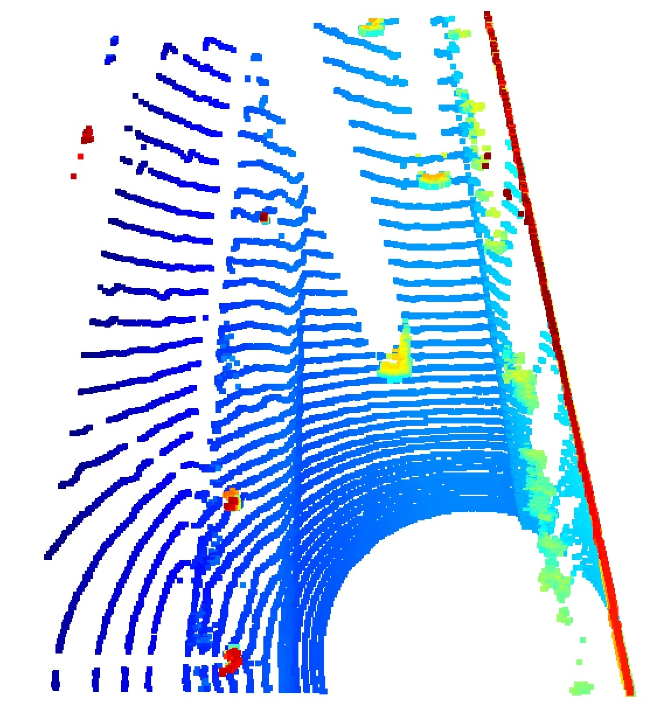
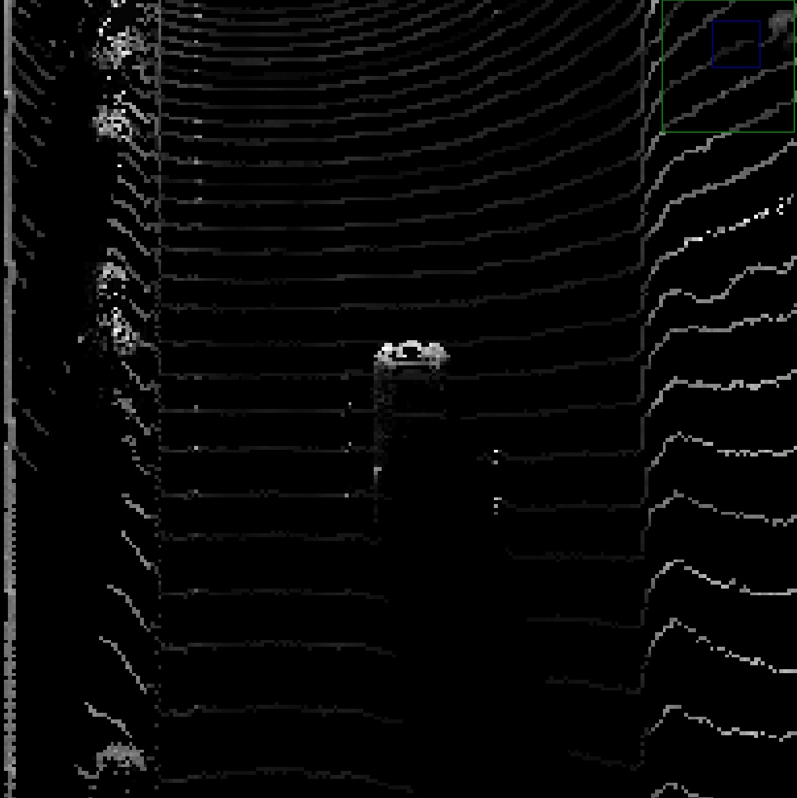
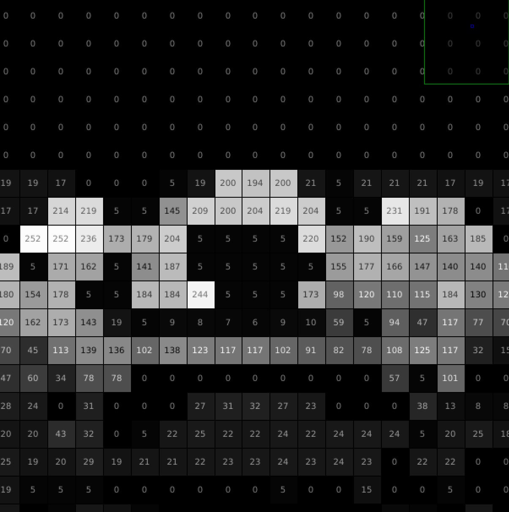

## Project overview
The main purpose of this step is "Create Birds-Eye view from Lidar PCL". I wrote the code within the function "bev_from_pcl" in the file "objdet_pcl.py".
### Convert sensor coordinates to BEV-map coordinates (ID_S2_EX1)
This image is the result of visualization into BEV-map coordinates of the point-cloud.

BEV-map of the point-cloud

### Compute intensity layer of the BEV map (ID_S2_EX2)
This image is the result of visualization into BEV-map coordinates of the intensity.
I cropped the top and bottom value of the intensity to separate the objects of interest from the background.

~~~objdet_pcl.py
    lidar_pcl_cpy[lidar_pcl_cpy[:,3]>0.5,3] = 0.5
    lidar_pcl_cpy[lidar_pcl_cpy[:,3]<=0.01,3] = 0.01
~~~

an intensity layer from the BEV-map

plotting intensity values from the BEV map

### Compute height layer of bev-map (ID_S2_EX3)
This image is the result of visualization into BEV-map coordinates of the height.

a height layer from the BEV-map

plotting height values from the BEV map
