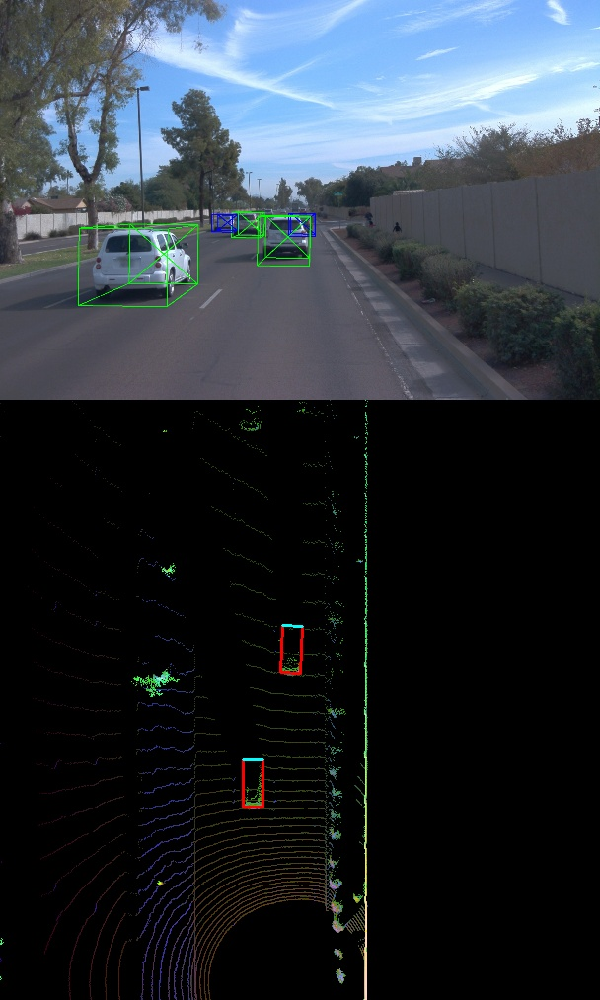

## Project overview
The main purpose of this step is "Model-based Object Detection in BEV Image". I wrote the code within the function "load_configs_model", "create_model", and "detect_objects" in the file "objdet_detect.py".

### Add a second model from a GitHub repo (ID_S3_EX1)
I showed the repo [Super Fast and Accurate 3D Object Detection based on 3D LiDAR Point Clouds](https://github.com/maudzung/SFA3D), and extracted the relevant codes.

### Extract 3D bounding boxes from model response (ID_S3_EX2)
I extracted the relevant codes from SFA3D, and visualized the bellow image.

3D bounding boxes added to the images

