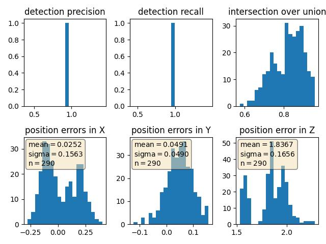
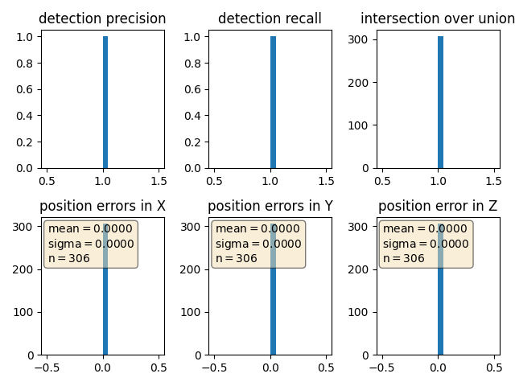

## Project overview
The main purpose of this step is "Performance Evaluation for Object Detection". I wrote the code within the function "measure_detection_performance" and "compute_performance_stats" in the file "objdet_eval.py".

### Compute intersection-over-union between labels and detections (ID_S4_EX1)
The results of ious and center devs are bellow.

ious: [0.8945780457551464, 0.767297077261263] 
center_devs: [[tensor(-0.0862), tensor(0.0487), 1.8152483974641882],[tensor(0.1464), tensor(0.0496), 1.8711946193956237]] 

### Compute false-negatives and false-positives (ID_S4_EX2)
The result of det_performance is bellow. The first components are ious, the second are center_devs, and the third are pos_negs.

det_performance: 
[[0.8945780457551464, 0.767297077261263], 
[[tensor(-0.0862), tensor(0.0487), 1.8152483974641882], [tensor(0.1464), tensor(0.0496), 1.8711946193956237]], 
[3, 2, 1, 1]]

### Compute precision and recall (ID_S4_EX3)
The results of precision and recall is bellow.

Graphing performance metrics (configs_det.use_labels_as_objects=True)  
  

Using the labels, metrics should get perfect scores (conf_thresh=0.5, min_iou=0.7)  
  