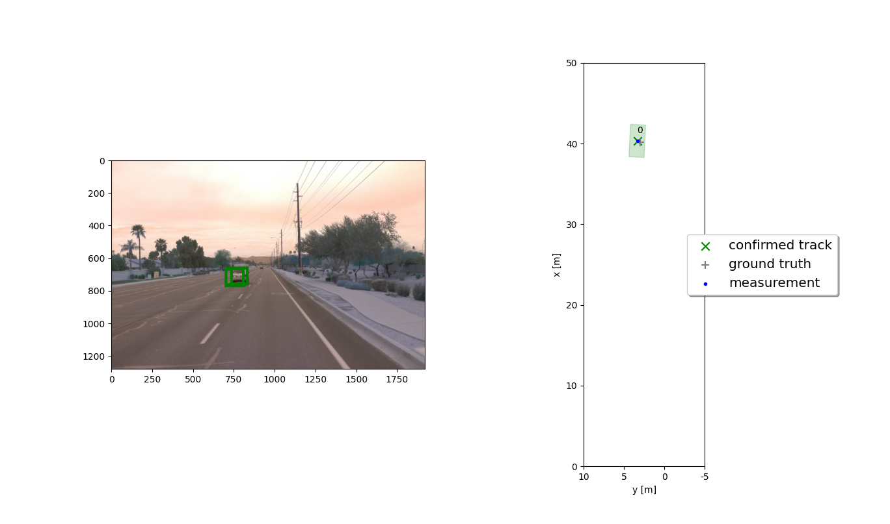
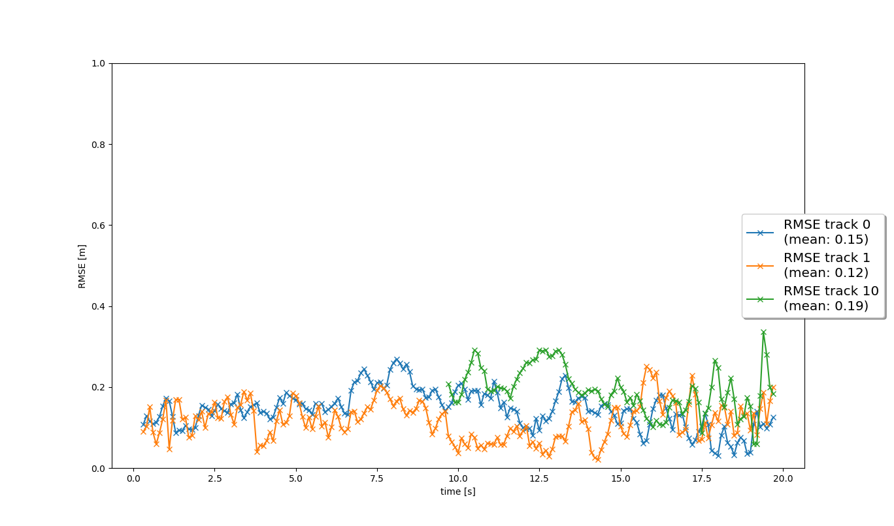
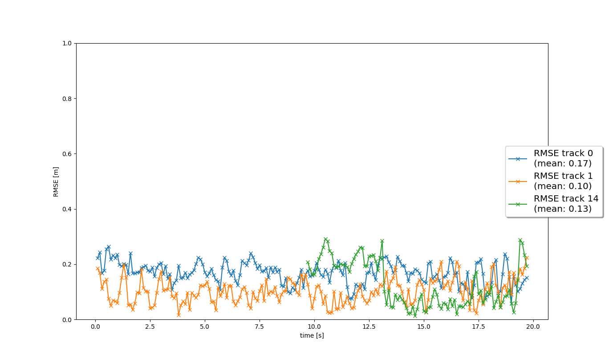

# Writeup: Track 3D-Objects Over Time

Please use this starter template to answer the following questions:

### 1. Write a short recap of the four tracking steps and what you implemented there (filter, track management, association, camera fusion). Which results did you achieve? Which part of the project was most difficult for you to complete, and why?

#### Step 1: Extended Kalman Filter (EKF)
I implemented an EKF in the "filter.py"
These images are the result of tracking and RMSE.

tracking 

RMSE 

#### Step 2: Track Management
I implemented an Track Management in the "trackmanagement.py"

RMSE 

#### Step 3: Data Association and Gating
I implemented an Track Management in the "association.py"

RMSE 

#### Step 4: Sensor Fusion
I implemented an Track Management in the "measurements.py"

RMSE 

### 2. Do you see any benefits in camera-lidar fusion compared to lidar-only tracking (in theory and in your concrete results)?
Lidar is good at measuring the distance between the object and the vehicle, but it has a low resolution. because of a high resolution, Camera is easy to detect the objects, but it can't measure the distance. Camera-lidar fusion system can have the ability of the good object detection and the accurate distance measurements.

### 3. Which challenges will a sensor fusion system face in real-life scenarios? Did you see any of these challenges in the project?
If one of the sensors fails, the system will stop working or show the poor performance, and it is difficult to calibrate camera and lidar. however, I didn't see both problems in the projects.

### 4. Can you think of ways to improve your tracking results in the future?
Yes. if we use the multi camera and lidar fusion system, we can get more accurate tracking results.
